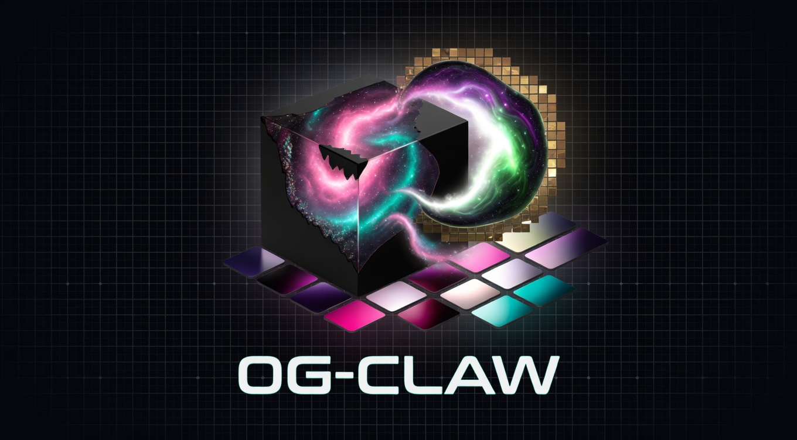

<div align="center">



# 0G-Claw

**OpenClaw, but your agent never forgets — and never depends on Big Tech.**

[](https://www.typescriptlang.org/)
[](https://0g.ai)
[](https://ethglobal.com/events/openagents)
[](LICENSE)

</div>

---

0G-Claw is a fork of [OpenClaw](https://github.com/openclaw/openclaw) that replaces its centralized dependencies with [0G's](https://0g.ai) decentralized infrastructure stack. The agent adapters are the only extension point — OpenClaw core is untouched.

| Layer | OpenClaw | 0G-Claw |
|---|---|---|
| **Memory** | Local disk (`~/.openclaw/`) | **0G Storage KV/Log** — portable across any device |
| **Inference** | OpenAI / Anthropic | **0G Compute** — open models, verifiable signed responses |
| **Identity** | None | **ENS** *(planned)* — agents addressable by name |

> Same agent, any machine, no vendor lock-in.

**Built for [ETHGlobal Open Agents](https://ethglobal.com/events/openagents) · [Architecture](docs/ARCHITECTURE.md) · [Demo Script](docs/DEMO_SCRIPT.md) · [Submission Notes](docs/SUBMISSION.md)**

---

## What works today (April 2026)

| Component | Status | Notes |
|---|---|---|
| `IMemoryAdapter` / `IComputeAdapter` interfaces | ✅ | Stable contracts; adapters are the only files touching 0G infra |
| `0GMemoryAdapter` — KV write/read for sessions | ✅ Live on Galileo testnet | Integration tests run against real testnet, not mocks |
| `0GMemoryAdapter` — Log append/read for history | ✅ Live on Galileo testnet | Same |
| `0GComputeAdapter` — inference via 0G Compute proxy | ✅ 21/21 live tests passing | Uses `@0glabs/0g-serving-broker` |
| Compute broker — ledger funded, provider acknowledged | ✅ 3 OG funded | Provider `0xa48f01287233509FD694a22Bf840225062E67836` (qwen/qwen-2.5-7b-instruct) |
| `LocalMemoryAdapter` + `OpenAIComputeAdapter` fallbacks | ✅ | Used automatically when 0G env vars are missing |
| Basic agent end-to-end (`examples/basic-agent/`) | ✅ | Adapter selection via `MEMORY_ADAPTER` / `COMPUTE_ADAPTER` env vars |
| Docker — single-container demo with persistent volume | ✅ | `./data/` survives `docker compose down` |
| ENS identity at agent creation | 🔜 planned | Targets ENS AI Agents track |
| Multi-device test (same wallet, two machines) | 🔜 planned | Final validation step before submission |
| Demo video (under 3 min) | 🔜 planned | See `docs/DEMO_SCRIPT.md` |

> **TL;DR for reviewers:** Both 0G adapters are live and tested against the Galileo testnet. The full stack (`MEMORY_ADAPTER=0g COMPUTE_ADAPTER=0g`) depends on Galileo Storage node availability — see [Demo flow](#demo-flow) for the recommended live-demo order.

---

## The Problem

OpenClaw is great. But it has two hard dependencies:

| Problem | OpenClaw Today | 0G-Claw |
|---|---|---|
| **Memory** | Lives in `~/.openclaw/agents/<id>/sessions/*.jsonl` — lose the disk, lose the agent | Persists in **0G Storage KV/Log** — portable across any device |
| **Inference** | Routes to OpenAI / Anthropic APIs — centralized, censorable, opaque | Routes to **0G Compute** — open models, verifiable inference, signed responses |

**The vision:** Same agent, any machine, no vendor lock-in.

---

## Architecture

```
┌─────────────────────────────────────────────────────┐
│                     0G-Claw                         │
│                                                     │
│  ┌─────────────────────────────────────────────┐   │
│  │              OpenClaw Core                  │   │
│  │   (Gateway, channels, session management)   │   │
│  └──────────────┬──────────────────────────────┘   │
│                 │ adapter interfaces                │
│        ┌────────┴─────────┐                        │
│        ▼                  ▼                        │
│  ┌──────────────┐  ┌───────────────┐               │
│  │  0GMemory    │  │  0GCompute    │               │
│  │  Adapter     │  │  Adapter      │               │
│  │              │  │               │               │
│  │ KV Store:    │  │ Models:       │               │
│  │ - sessions   │  │ - qwen-2.5-7b │               │
│  │ - agent state│  │ - gpt-oss-20b │               │
│  │              │  │ - gemma-3-27b │               │
│  │ Log Store:   │  │               │               │
│  │ - history    │  │ Endpoint:     │               │
│  │              │  │ 0G proxy API  │               │
│  └──────┬───────┘  └──────┬────────┘               │
│         │                 │                        │
└─────────┼─────────────────┼────────────────────────┘
          ▼                 ▼
   ┌─────────────┐   ┌─────────────┐
   │  0G Storage │   │  0G Compute │
   │  (Galileo   │   │  (Galileo   │
   │   testnet)  │   │   testnet)  │
   └─────────────┘   └─────────────┘
```

The adapter interfaces are the extension point. You can swap `0GMemoryAdapter` for `LocalMemoryAdapter` (or `RedisMemoryAdapter`, etc.) without touching OpenClaw. Same for compute.

For deeper architecture details, see [docs/ARCHITECTURE.md](docs/ARCHITECTURE.md).

---

## Repo structure

```
0g-claw/
├── adapters/
│   ├── memory/
│   │   ├── 0GMemoryAdapter.ts      # 0G Storage KV/Log implementation
│   │   ├── LocalMemoryAdapter.ts   # Fallback (writes to ~/.0g-claw)
│   │   └── IMemoryAdapter.ts       # Contract — extension point
│   └── compute/
│       ├── 0GComputeAdapter.ts     # 0G Compute via @0glabs/0g-serving-broker
│       ├── OpenAIComputeAdapter.ts # Fallback
│       └── IComputeAdapter.ts      # Contract
├── examples/
│   ├── basic-agent/                # Conversational chat agent (chat loop)
│   │   ├── agent.ts
│   │   └── README.md
│   └── research-agent/             # Topic-driven research pipeline (plan → research → synthesize)
│       ├── agent.ts
│       ├── README.md
│       ├── lib/                    # topicId, prompts, types
│       └── tools/                  # WikipediaSearchTool, MemoryRecallTool, ITool
├── scripts/
│   ├── check-testnet.ts            # Pre-flight: verifies 0G connectivity
│   └── setup-compute-broker.ts     # One-time broker funding helper
├── docs/
│   ├── ARCHITECTURE.md
│   ├── DEMO_SCRIPT.md
│   └── SUBMISSION.md
├── openclaw/                       # OpenClaw as git submodule (do not modify)
├── Dockerfile
├── docker-compose.yml
├── .env.example
└── package.json
```

---

## Quickstart (no Docker)

### 1. Prerequisites

- Node.js 18+ (tested on 20)
- pnpm (`npm install -g pnpm`)
- A wallet with 0G testnet tokens — see [build.0g.ai](https://build.0g.ai) and the [faucet](https://faucet.0g.ai)

### 2. Clone & install

```bash
git clone https://github.com/DarienPerezGit/0G-CLAW.git
cd 0G-CLAW
pnpm install
```

### 3. Configure environment

```bash
cp .env.example .env
```

Edit `.env`:

```env
# 0G Storage
OG_STORAGE_RPC=https://evmrpc-testnet.0g.ai
OG_STORAGE_INDEXER=https://indexer-storage-testnet-turbo.0g.ai
OG_PRIVATE_KEY=your_wallet_private_key

# 0G Compute — provider on Galileo testnet
# Full list in .env.example
OG_COMPUTE_PROVIDER=0xa48f01287233509FD694a22Bf840225062E67836
```

### 4. Verify connectivity

```bash
pnpm check:testnet
```

This confirms RPC, indexer, balance, and provider reachability before you spend a session.

### 5. Run an example agent

The repo ships **two reference agents** built on the same adapter layer — proof that 0G-Claw is a framework, not a single-use codebase.

```bash
# Local memory + local compute (no creds needed)
pnpm example:basic

# 0G memory + local compute
MEMORY_ADAPTER=0g pnpm example:basic

# Fully decentralized (requires funded broker)
MEMORY_ADAPTER=0g COMPUTE_ADAPTER=0g pnpm example:basic

# Topic-driven research pipeline
RESEARCH_TOPIC="0G decentralized AI" pnpm example:research
```

Both agents share the same `IMemoryAdapter` and `IComputeAdapter`. Kill either process, run it again with the same wallet — memory is still there.

---

## Run with Docker

Single-command demo. Memory persists in `./data/` on the host, mounted as the agent's home directory inside the container.

```bash
cp .env.example .env
# Fill in .env with real credentials before running

docker compose up --build
```

The container exits when the agent finishes its scripted run; `restart: unless-stopped` brings it back. All session and history files land in `./data/` and survive `docker compose down`.

To start fresh:

```bash
docker compose down -v
sudo rm -rf data/   # files are owned by root because the container ran as root
```

> **Note:** Docker does **not** run 0G infrastructure. The container talks to the same external Galileo testnet as the host. If `OG_PRIVATE_KEY` is empty in `.env`, the agent falls back to local adapters automatically — no errors, just no decentralization.

See [docs/ARCHITECTURE.md](docs/ARCHITECTURE.md) for how the volume mount and `HOME=/app` env var line up with `LocalMemoryAdapter`'s default storage path.

---

## 0G Compute — broker funding requirements

`0GComputeAdapter` uses `@0glabs/0g-serving-broker` to talk to providers. Before a wallet can make inference requests, it must:

1. **Hold ≥ 3 OG tokens** on Galileo testnet (faucet at [faucet.0g.ai](https://faucet.0g.ai))
2. **Open a broker ledger** — `broker.ledger.addLedger(3)`
3. **Acknowledge the provider signer** — `broker.inference.acknowledgeProviderSigner(OG_COMPUTE_PROVIDER)`
4. **Transfer funds to the provider** — `broker.ledger.transferFund(OG_COMPUTE_PROVIDER, "inference", amount)`

All four steps are automated by the helper script:

```bash
pnpm setup:broker
```

Run it once per wallet. State persists on-chain — re-running is idempotent.

### Active providers (Galileo, validated April 2026)

| Provider address | Model |
|---|---|
| `0xa48f01287233509FD694a22Bf840225062E67836` | `qwen/qwen-2.5-7b-instruct` |
| `0x8e60d466FD16798Bec4868aa4CE38586D5590049` | `openai/gpt-oss-20b` |
| `0x69Eb5a0BD7d0f4bF39eD5CE9Bd3376c61863aE08` | `google/gemma-3-27b-it` |

The default in `.env.example` points at the qwen provider, which has the most stable uptime as of April 2026.

---

## 0G Compute — deferred execution pattern

`0GComputeAdapter` uses a **deferred execution** pattern: it lazily resolves the broker, provider metadata, and endpoint on first use, then caches them for the rest of the session. Two reasons:

1. **Cold-start safety.** Constructing the adapter doesn't touch the network. If `OG_COMPUTE_PROVIDER` isn't set, the adapter is constructed but never invoked — fallback runs without paying broker setup cost.
2. **Failure isolation.** If the broker / provider is unreachable, the failure happens at request time with a clear error, not at agent boot.

This is what lets the agent boot in any environment (CI, Docker, fresh laptop) without 0G credentials, and only call into 0G when an inference is actually requested.

---

## Research Agent

`examples/research-agent/` demonstrates how 0G-Claw can power a tool-using agent while preserving the same adapter architecture.

Given a `RESEARCH_TOPIC`, the agent:
1. Generates a research plan via `IComputeAdapter`
2. Executes each step using `WikipediaSearchTool` (public HTTP, no API key)
3. Synthesizes findings back through `IComputeAdapter`
4. Persists all session data via `IMemoryAdapter`

It uses the same `MEMORY_ADAPTER` / `COMPUTE_ADAPTER` env vars as `basic-agent` and falls back to local adapters when 0G credentials are absent. It is a reference implementation, not production-ready.

```bash
RESEARCH_TOPIC="0G decentralized AI" pnpm example:research

# Inspect a past session
SESSION_ID=<id> pnpm example:research:inspect
```

See [`examples/research-agent/README.md`](examples/research-agent/README.md) for full usage.

---

## ENS Integration (Bonus track — planned)

Each agent will get an ENS identity at creation:

```typescript
// agent.ens = `<label>.0gclaw.eth`
// ENS text records:
//   "0gclaw.memory" → 0G KV root hash
//   "0gclaw.model"  → provider address
```

This makes agents discoverable by name and qualifies for the ENS AI Agents track ($2,500). See `.env.example` for `ENS_AGENT_LABEL` (currently a placeholder until the integration lands).

---

## Why not LangChain?

LangChain and CrewAI assume a coordinator — a central process that orchestrates everything. OpenClaw is personal and local-first. 0G-Claw keeps that philosophy but makes the persistence layer decentralized. You're not building a pipeline.

---

## 0G Protocol usage summary

| Component | Used for | Why |
|---|---|---|
| 0G Storage — KV Store | Session state, agent config | Fast random-access read/write |
| 0G Storage — Log Store | Conversation history | Append-only, replayable from any point |
| 0G Compute | LLM inference | Open models, signed responses, no vendor key |
| 0G Chain | (ENS anchor — planned) | On-chain agent identity |

SDKs: `@0gfoundation/0g-ts-sdk` (storage), `@0glabs/0g-serving-broker` (compute), `@ensdomains/ensjs` (identity).

---

## Documentation

- [docs/ARCHITECTURE.md](docs/ARCHITECTURE.md) — adapter contracts, data flow, capability model
- [docs/DEMO_SCRIPT.md](docs/DEMO_SCRIPT.md) — 3-minute live demo walkthrough
- [docs/SUBMISSION.md](docs/SUBMISSION.md) — ETHGlobal submission checklist and tracks
- [examples/basic-agent/README.md](examples/basic-agent/README.md) — agent CLI usage and env var matrix
- [CLAUDE.md](CLAUDE.md) — agent-engineering rules for contributors using Claude

---

## License

MIT
